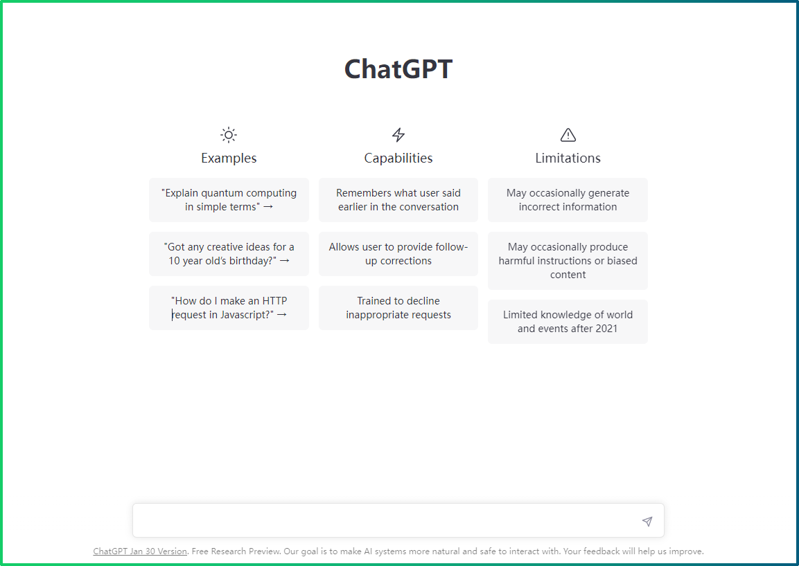
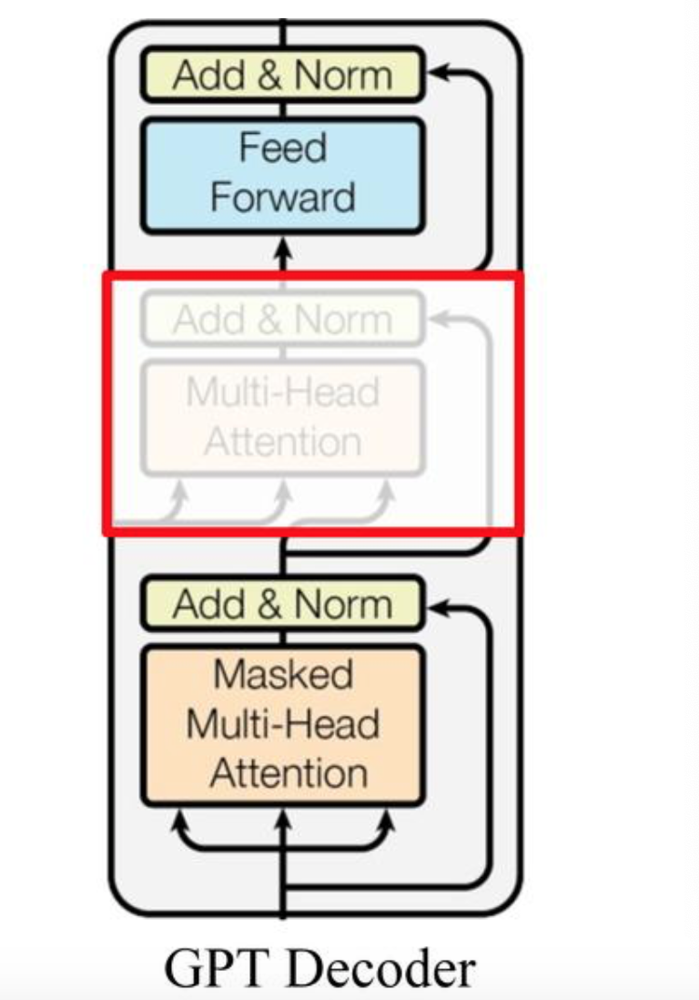
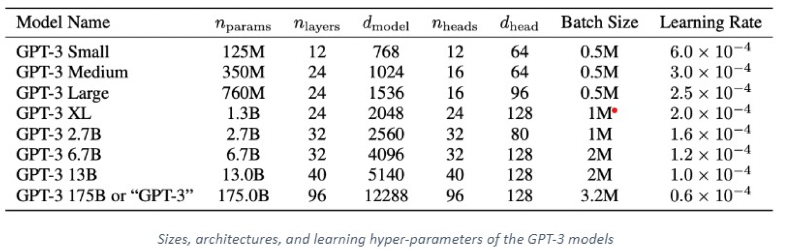
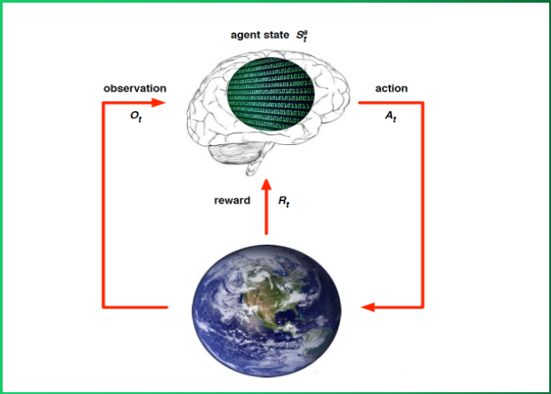
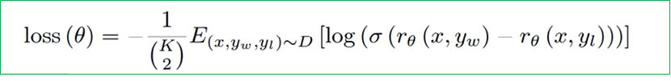

## ChatGPT背后的原理

### 1 ChatGPT回顾

- 2022 年 11 月 30 日，OpenAI 的CEO，Altman 在推特上写道：“今天我们推出了 ChatGPT，尝试在这里与它交谈”，然后是一个链接，任何人都可以注册一个帐户，开始免费与 OpenAI 的新聊天机器人 ChatGPT 交谈。

- ChatGPT 看起来什么都懂，就像个百科全书。由于其流畅的回答，丰富的知识，给参与者极大的震撼。但它并不完美，也会产生让人啼笑皆非的错误，带来莫名的喜感。

- 数据显示，到目前为止ChatGPT的月活跃用户在2023年2月份已经超过1亿，这距离它推出只有2个多月时间，成为史上增长最快的消费者应用。全球每天约有1300万独立访问者使用ChatGPT，是12月份的两倍多，而爆炸性的增量也给该公司发展带来了想象空间。

- 自从 ChatGPT 出现后。突然之间，每个人都在谈论人工智能如何颠覆他们的工作、公司、学校和生活。那么ChatGPT背后的实现原理是什么呢？接下来我们将给大家进行一一解析。

### 2 ChatGPT的由来

- ChatGPT本质是OpenAI开发的一个大型预训练语言模型。它是由GPT-3模型演变而来，GPT-3经过训练，可以在对话中生成类似人类的文本响应。ChatGPT 旨在用作聊天机器人，我们可以对其进行微调，以完成各种任务，如回答问题、提供信息或参与对话。

- 在我们了解ChatGPT模型原理之前，需要回顾下ChatGPT的成长史，即我们需要对GPT-1、GPT-2、GPT-3等一系列模型进行了解和学习，以便我们更好的理解ChatGPT的算法原理。

- 接下来我们将对GPT一系列模型进行介绍：

### 3 GPT-1介绍

- 2018年6月，OpenAI公司发表了论文“Improving Language Understanding by Generative Pre-training”《用生成式预训练提高模型的语言理解力》，推出了具有1.17亿个参数的GPT-1（Generative Pre-training Transformers, 生成式预训练变换器）模型。
- 与BERT最大的区别在于GPT-1采用了传统的语言模型方法进行预训练, 即使用单词的上文来预测单词, 而BERT是采用了双向上下文的信息共同来预测单词.
  - 正是因为训练方法上的区别, 使得GPT更擅长处理自然语言生成任务(NLG), 而BERT更擅长处理自然语言理解任务(NLU).

#### 3.1 GPT-1模型架构

- 看三个语言模型的对比架构图, 中间的就是GPT-1:

> - 从上图可以很清楚的看到GPT采用的是单向Transformer模型, 例如给定一个句子[u1, u2, ..., un], GPT在预测单词ui的时候只会利用[u1, u2, ..., u(i-1)]的信息, 而BERT会同时利用上下文的信息[u1, u2, ..., u(i-1), u(i+1), ..., un].

> - 作为两大模型的直接对比, BERT采用了Transformer的Encoder模块, 而GPT采用了Transformer的Decoder模块. 并且GPT的Decoder Block和经典Transformer Decoder Block还有所不同, 如下图所示:

> - 如上图所示, 经典的Transformer Decoder Block包含3个子层, 分别是Masked Multi-Head Attention层, encoder-decoder attention层, 以及Feed Forward层. 但是在GPT中取消了第二个encoder-decoder attention子层, 只保留Masked Multi-Head Attention层, 和Feed Forward层.

> - 注意: 对比于经典的Transformer架构, 解码器模块采用了6个Decoder Block; GPT的架构中采用了12个Decoder Block.

#### 3.2 GPT-1训练过程

GPT-1的训练包括两阶段过程:

- 第一阶段: 无监督的预训练语言模型.
- 第二阶段: 有监督的下游任务fine-tunning.

##### 3.2.1 无监督的预训练语言模型

- 给定句子U = [u1, u2, ..., un], GPT训练语言模型时的目标是最大化下面的似然函数:

$$
L_1(U)=\sum_i\log P(u_i|u_{i-k},\cdots,u_{i-1};\Theta)
$$

- 有上述公式可知, GPT是一个单向语言模型, 假设输入张量用h0表示, 则计算公式如下:

$$
h_0 = UW_e + W_p
$$

> 其中Wp是单词的位置编码, We是单词本身的word embedding. Wp的形状是[max_seq_len, embedding_dim], We的形状是[vocab_size, embedding_dim].

- 得到输入张量h0后, 要将h0传入GPT的Decoder Block中, 依次得到ht:

$$
h_t = transformer\_block(h_{l-1})\;\;\;\;l\in[1,t]
$$

- 最后通过得到的ht来预测下一个单词:

$$
P(u)=softmax(h_tW_e^T)
$$

##### 3.2.2 有监督的下游任务fine-tunning

- GPT经过预训练后, 会针对具体的下游任务对模型进行微调. 微调采用的是有监督学习, 训练样本包括单词序列[x1, x2, ..., xn]和label y. GPT微调的目标任务是根据单词序列[x1, x2, ..., xn]预测标签y.

$$
P(y|x^1,\cdots,x^m)=softmax(h_l^mW_y)
$$

> 其中$W_y$表示预测输出的矩阵参数, 微调任务的目标是最大化下面的函数:

$$
L_2=\sum_{(x,y)}\log P(y|x^1,\cdots,x^m)
$$

- 综合两个阶段的目标任务函数, 可知GPT的最终优化函数为:

$$
L_3 = L_2 + \lambda L_1
$$

##### 3.2.3 整体训练过程架构图

- 根据下游任务适配的过程分两步：1、根据任务定义不同输入，2、对不同任务增加不同的分类层。

- 具体定义可以参见下图：

- 分类任务（Classification）：将起始和终止token加入到原始序列两端，输入transformer中得到特征向量，最后经过一个全连接得到预测的概率分布；
- 文本蕴涵（Entailment）：将前提（premise）和假设（hypothesis）通过分隔符（Delimiter）隔开，两端加上起始和终止token。再依次通过transformer和全连接得到预测结果；
- 文本相似度（Similarity）：输入的两个句子，正向和反向各拼接一次，然后分别输入给transformer，得到的特征向量拼接后再送给全连接得到预测结果；
- 问答和常识推理（Multiple-Choice）：将 N个选项的问题抽象化为N个二分类问题，即每个选项分别和内容进行拼接，然后各送入transformer和全连接中，最后选择置信度最高的作为预测结果

#### 3.3  GPT-1数据集

- GPT-1使用了BooksCorpus数据集，这个数据集包含 7000 本没有发布的书籍，选择该部分数据集的原因：
  - 数据集拥有更长的上下文依赖关系，使得模型能学得更长期的依赖关系；
  - 这些书籍因为没有发布，所以很难在下游数据集上见到，更能验证模型的泛化能力。

#### 3.3 GPT-1模型的特点

- 优点
  - 在有监督学习的12个任务中，GPT-1在9个任务上的表现超过了state-of-the-art的模型
  - 利用Transformer做特征抽取，能够捕捉到更长的记忆信息，且较传统的 RNN 更易于并行化
- 缺点
  - GPT 最大的问题就是传统的语言模型是单向的。
  - 针对不同的任务，需要不同的数据集进行模型微调，相对比较麻烦

#### 3.4 GPT-1模型总结

- GPT-1证明了transformer对学习词向量的强大能力，在GPT-1得到的词向量基础上进行下游任务的学习，能够让下游任务取得更好的泛化能力。对于下游任务的训练，GPT-1往往只需要简单的微调便能取得非常好的效果。

- GPT-1在未经微调的任务上虽然也有一定效果，但是其泛化能力远远低于经过微调的有监督任务，说明了GPT-1只是一个简单的领域专家，而非通用的语言学家。

### 4 GPT-2介绍

- 2019年2月，OpenAI推出了GPT-2，同时，他们发表了介绍这个模型的论文“Language Models are Unsupervised Multitask Learners” （语言模型是无监督的多任务学习者）。
- 相比于GPT-1，GPT-2突出的核心思想为多任务学习，其目标旨在仅采用无监督预训练得到一个泛化能力更强的语言模型，直接应用到下游任务中。GPT-2并没有对GPT-1的网络结构进行过多的创新与设计，而是使用了更多的网络参数与更大的数据集：最大模型共计48层，参数量达15亿。

#### 4.1 GPT-2模型架构

- 在模型方面相对于 GPT-1 来说GPT-2做了微小的改动：
  - LN层被放置在Self-Attention层和Feed Forward层前，而不是像原来那样后置
  - 在最后一层Tansfomer Block后增加了LN层

#### 4.2 GPT-2训练核心思想

- 目前最好的 NLP 模型是结合无监督的 Pre-training 和监督学习的 Fune-tuning，但这种方法的缺点是针对某特定任务需要不同类型标注好的训练数据。GPT-2的作者认为这是狭隘的专家而不是通才，因此该作者希望能够通过无监督学习训练出一个可以应对多种任务的通用系统。
- 因此，GPT-2的训练去掉了Fune-tuning只包括无监督的预训练过程，和GPT-1第一阶段训练一样，也属于一个单向语言模型
- GPT-2模型的学习目标：**使用无监督的预训练模型做有监督的任务。**
  - 语言模型其实也是在给序列的条件概率建模，即p(sn|s1,s2,...,sn−1)
  - 任何有监督任务，其实都是在估计p(output|input),通常我们会用特定的网络结构去给任务建模，但如果要做通用模型，它需要对p(output|input,task)建模。对于NLP任务的input和output，我们平常都可以用向量表示，而对于task，其实也是一样的。18年已经有研究对task进行过建模了，这种模型的一条训练样本可以表示为:(translate to french,English text,french text),实验证明以这种数据形式可以有监督地训练一个single model，其实也就是对一个模型进行有监督的多任务学习。
  - 语言模型=无监督多任务学习。相比于有监督的多任务学习，语言模型只是不需要显示地定义哪些字段是要预测的输出，所以，实际上有监督的输出只是语言模型序列中的一个子集。举个例子，比如我在训练语言模型时，有一句话“The translation of word Machine Learning in chinese is 机器学习”，那在训练完这句话时，语言模型就自然地将翻译任务和任务的输入输出都学到了。再比如，当模型训练完“Micheal Jordan is the best basketball player in the history”语料的语言模型之后，便也学会了(question：“who is the best basketball player in the history ?”，answer:“Micheal Jordan”)的Q&A任务。
  - j基于上面的思想，作者将GPT-2模型根据给定输入与任务来做出相应的输出，那么模型就可以表示成下面这个样子：p(output∣input,task),例如可以直接输入：(“自然语言处理”, 中文翻译)来得到我们需要的结果(“Nature Language Processing”)，因此提出的模型可以将机器翻译，自然语言推理，语义分析，关系提取等10类任务统一建模为一个任务，而不再为每一个子任务单独设计一个模型。
- 综上，GPT-2的核心思想概括为：任何有监督任务都是语言模型的一个子集，当模型的容量非常大且数据量足够丰富时，仅仅靠训练语言模型的学习便可以完成其他有监督学习的任务。

#### 4.3 GPT-2的数据集

- GPT-2的文章取自于Reddit上高赞的文章，命名为WebText。数据集共有约800万篇文章，累计体积约40G。为了避免和测试集的冲突，WebText移除了涉及Wikipedia的文章。

#### 4.3 GPT-2模型的特点

- 优点
  - 文本生成效果好，在8个语言模型任务中，仅仅通过zero-shot学习，GPT-2就有7个超过了state-of-the-art的方法。
  - 海量数据和大量参数训练出来的词向量模型有迁移到其它类别任务中而不需要额外的训练。
- 缺点：
  - 无监督学习能力有待提升
  - 有些任务上的表现不如随机

#### 4.4 GPT-2模型总结

- GPT-2的最大贡献是验证了通过海量数据和大量参数训练出来的词向量模型有迁移到其它类别任务中而不需要额外的训练。但是很多实验也表明，GPT-2的无监督学习的能力还有很大的提升空间，甚至在有些任务上的表现不比随机的好。尽管在有些zero-shot的任务上的表现不错，但是我们仍不清楚GPT-2的这种策略究竟能做成什么样子。GPT-2表明随着模型容量和数据量的增大，其潜能还有进一步开发的空间，基于这个思想，诞生了我们下面要介绍的GPT-3。

### 5 GPT-3介绍

- 2020年5月，OpenAI发布了GPT-3，同时发表了论文“Language Models are Few-Shot Learner”《小样本学习者的语言模型》。

- GPT-3 作为其先前语言模型 (LM) GPT-2 的继承者。 它被认为比GPT-2更好、更大。事实上，与他语言模型相比，OpenAI GPT-3 的完整版拥有大约 1750 亿个可训练参数，是迄今为止训练的最大模型，这份 72 页的[研究论文](https://arxiv.org/pdf/2005.14165.pdf) 非常详细地描述了该模型的特性、功能、性能和局限性。

- 下图为不同模型之间训练参数的对比：

#### 5.1 GPT-3模型架构

- 实际上GPT-3 不是一个单一的模型，而是一个模型系列。系列中的每个模型都有不同数量的可训练参数。下表显示了每个模型、体系结构及其对应的参数：

- 事实上，GPT-3 系列模型结构与GPT-2完全一致，为了探究机器学习性能和模型参数的关系，作者分别训练了包含1.25亿至1750亿参数的8个模型，并把1750亿参数的模型命名为GPT-3。
- 其中最大版本 GPT-3 175B 或“GPT-3”具有175个B参数、96层的多头Transformer、Head size为96、词向量维度为12288、文本长度大小为2048。

#### 5.2 GPT-3训练核心思想

- GPT-3模型训练的思想与GPT-2的方法相似，去除了fine-tune过程，只包括预训练过程，不同只在于采用了参数更多的模型、更丰富的数据集和更长的训练的过程。

- 但是GPT-3 模型在进行下游任务时采用了一种新的思想，即情境学习(in-context learning)。情境学习理解：在被给定的几个任务示例或一个任务说明的情况下，模型应该能通过简单预测以补全任务中其他的实例。即情境学习要求预训练模型要对任务本身进行理解。在GPT-3模型中给出了三种不同类型的情景学习，他们分别是：Few-shot、One-shot、Zero-shot。

- 下面以从“英语到法语的翻译任务”为例，分别对比传统的微调策略和GPT-3三种情景学习方式。

- 下图是传统的微调策略：

  

- 传统的微调策略存在问题：

  - 微调需要对每一个任务有一个任务相关的数据集以及和任务相关的微调。
  - 需要一个相关任务大的数据集，而且需要对其进行标注
  - 当一个样本没有出现在数据分布的时候，泛化性不见得比小模型要好

- 下图显示了 GPT-3 三种情景学习方法:

  

- zero-shot learning
  - 定义：给出任务的描述，然后提供测试数据对其进行预测，直接让预训练好的模型去进行任务测试。
  - 示例：向模型输入“这个任务要求将中文翻译为英文。销售->”，然后要求模型预测下一个输出应该是什么，正确答案应为“sell”

- one-shot learning
  - 定义：在预训练和真正翻译的样本之间，插入一个样本做指导。相当于在预训练好的结果和所要执行的任务之间，给一个例子，告诉模型英语翻译为法语，应该这么翻译。
  - 示例：向模型输入“这个任务要求将中文翻译为英文。你好->hello，销售->”，然后要求模型预测下一个输出应该是什么，正确答案应为“sell”。

- few-shot learning
  - 定义：在预训练和真正翻译的样本之间，插入多个样本做指导。相当于在预训练好的结果和所要执行的任务之间，给多个例子，告诉模型应该如何工作。
  - 示例：向模型输入“这个任务要求将中文翻译为英文。你好->hello，再见->goodbye，购买->purchase，销售->”，然后要求模型预测下一个输出应该是什么，正确答案应为“sell”。

#### 5.3 GPT-3数据集

- 一般来说，模型的参数越多，训练模型所需的数据就越多。GPT-3共训练了5个不同的语料大约 45 TB 的文本数据，分别是低质量的Common Crawl，高质量的WebText2，Books1，Books2和Wikipedia，GPT-3根据数据集的不同的质量赋予了不同的权值，权值越高的在训练的时候越容易抽样到，如下表所示。

|       **数据集**        | **数量（tokens）** | **训练数据占比** |
| :---------------------: | :----------------: | :--------------: |
| Common Crawl（filterd） |       4100亿       |       60%        |
|        Web Text2        |       190亿        |       22%        |
|          BOOK1          |       120亿        |        8%        |
|          BOOK2          |       550亿        |        8%        |
|        Wikipedia        |        30亿        |        2%        |

- 不同数据的介绍：
  - Common Crawl语料库包含在 8 年的网络爬行中收集的 PB 级数据。语料库包含原始网页数据、元数据提取和带有光过滤的文本提取。
  - WebText2是来自具有 3+ upvotes 的帖子的所有出站 Reddit 链接的网页文本。
  - Books1和Books2是两个基于互联网的图书语料库。
  - 英文维基百科页面 也是训练语料库的一部分。

#### 5.4 GPT-3模型的特点

- 优点
  - 整体上，GPT-3在zero-shot或one-shot设置下能取得尚可的成绩，在few-shot设置下有可能超越基于fine-tune的SOTA模型。
  - 去除了fune-tuning任务。
- 缺点：
  - 由于40TB海量数据的存在，很难保证GPT-3生成的文章不包含一些非常敏感的内容
  - 对于部分任务比如：“判断命题是否有效”等，会给出没有意义的答案

#### 5.5 GPT-3模型总结

- GPT系列从1到3，通通采用的是transformer架构，可以说模型结构并没有创新性的设计。GPT-3的本质还是通过海量的参数学习海量的数据，然后依赖transformer强大的拟合能力使得模型能够收敛。得益于庞大的数据集，GPT-3可以完成一些令人感到惊喜的任务，但是GPT-3也不是万能的，对于一些明显不在这个分布或者和这个分布有冲突的任务来说，GPT-3还是无能为力的。

### 6 ChatGPT介绍

- ChatGPT是一种基于GPT-3的聊天机器人模型。它旨在使用 GPT-3 的语言生成能力来与用户进行自然语言对话。例如，用户可以向 ChatGPT 发送消息，然后 ChatGPT 会根据消息生成一条回复。
- GPT-3 是一个更大的自然语言处理模型，而 ChatGPT 则是使用 GPT-3 来构建的聊天机器人。它们之间的关系是 ChatGPT 依赖于 GPT-3 的语言生成能力来进行对话。
- 目前基于ChatGPT的论文并没有公布，因此接下来我们基于openai官网的介绍对其原理进行解析

#### 6.1 ChatGPT原理

- 在介绍ChatGPT原理之前，请大家先思考一个问题：“模型越大、参数越多，模型的效果就越好么啊？”。这个答案是否定的，因为模型越大可能导致结果越专一，但是这个结果有可能并不是我们期望的。这也称为大型语言模型能力不一致问题。在机器学习中，有个重要的概念：“过拟合”，所谓的过拟合，就是模型在训练集上表现得很好，但是在测试集表现得较差，也就是说模型在最终的表现上并不能达到我们的预期，这就是模型能力不一致问题。
- 原始的 GPT-3 就是非一致模型，类似GPT-3 的大型语言模型都是基于来自互联网的大量文本数据进行训练，能够生成类似人类的文本，但它们可能并不总是产生符合人类期望的输出。
- ChatGPT 为了解决模型的不一致问题，使用了人类反馈来指导学习过程，对其进行了进一步训练。所使用的具体技术就是强化学习(RLHF) 。ChatGPT 是第一个将此技术用于实际场景的模型。

##### 6.1.1什么是强化学习

- 强化学习（Reinforcement Learning, RL），又称再励学习、评价学习或增强学习，是机器学习方法的一种，用于描述和解决智能体（agent）在与环境的交互过程中通过学习策略以达成回报最大化或实现特定目标的问题。

- 强化学习的关键信息：
  - 一种机器学习方法
  - 关注智能体与环境之间的交互
  - 目标是追求最大回报
- 强化学习的架构
  - 下图是强化学习的基本流程整体架构，其中大脑指代智能体agent，地球指代环境environment，从当前的状态St出发，在做出一个行为At 之后，对环境产生了一些影响，它首先给agent反馈了一个奖励信号Rt然后给agent反馈一个新的环境状态，此处用Ot 表示，进而融汇进入一个新的状态，agent再做出新的行为，形成一个循环。

- 理解强化学习基本要素

  - 这里我们以大家最熟悉的超级玛丽小游戏为代表为大家讲解强化学习的基本要素：

  

  - Agent（智能体）：强化学习训练的主体就是Agent，这里统称为“智能体”。超级玛丽中马里奥就是Agent。
  - Environment（环境）： 整个游戏的大背景就是环境；超级玛丽中Agent、Goomba、金币以及里面各个草地板块组成了整个环境。
  - State（状态）： 当前 Environment和Agent所处的状态，因为马里奥一直在移动，金币数目也在不停变化，Agent的位置也在不停变化，所以整个State处于变化中.
  - Policy（策略）： Policy的意思就是根据观测到的状态来进行决策，来控制Agent运动。即基于当前的State，Agent可以采取哪些Action，比如向左、向右或者向上。在数学上Policy一般定义为函数π（深度学习中Policy可以定义为一个模型），这个policy函数π是个概率密度函数：

  $$
  π(a|s) = P(A=a|S=s)
  $$

  - Reward（奖励）： Agent在当前State下，采取了某个特定的Action后，会获得环境的一定反馈（或奖励）就是Reward。比如：马里奥吃到一个金币奖励R=+1,如果赢了这场游戏奖励R=+10000，我们应该把打赢游戏的奖励定义的大一些，这样才能激励学到的policy打赢游戏而不是一味的吃金币，如果马里奥碰到敌人Goomba，马里奥就会死，游戏结束，这时奖励就设R=-10000，如果这一步什么也没发生，奖励就是R=0，强化学习的目标就是使获得的奖励总和尽量要高。

- 如何让AI实现自动打游戏？

  - 第一步：通过强化学习（机器学习方法）学出Policy函数，该步骤目的是用Policy函数来控制Agent。
  - 第二步：获取当前状态为s1，并将s1带入Policy函数来计算概率，从概率结果中抽样得到a1，同时环境生成下一状态s2，并且给Agent一个奖励r1。
  - 第三步：将新的状态s2带入Policy函数来计算概率，抽取结果得到新的动作a2、状态s3、奖励r2
  - 第四步：循环2-3步骤，直到打赢游戏或者game over，这样我们就会得到一个游戏的trajectory（轨迹），这个轨迹是每一步的状态，动作，奖励。

##### 6.1.2 ChatGPT强化学习步骤

- 从人类反馈中进行强化学习，该方法总体上包括三个步骤：
  - 步骤1：有监督的调优，预训练的语言模型在少量已标注的数据上进行调优，以学习从给定的 prompt 列表生成输出的有监督的策略（即 SFT 模型）；
  - 步骤2：模拟人类偏好：标注者们对相对大量的 SFT 模型输出进行投票，这就创建了一个由比较数据组成的新数据集。在此数据集上训练新模型，被称为训练奖励模型（Reward Model，RM）；
  - 步骤3：近端策略优化（PPO）：RM 模型用于进一步调优和改进 SFT 模型，PPO 输出结果的是策略模式。
- 步骤 1 只进行一次，而步骤 2 和步骤 3 可以持续重复进行：在当前最佳策略模型上收集更多的比较数据，用于训练新的 RM 模型，然后训练新的策略。接下来，将对每一步的细节进行详述。

##### 6.1.3 监督调优模型

- 工作原理：
  - 第一步是收集数据，以训练有监督的策略模型。
  - 数据收集：选择一个提示列表，标注人员按要求写下预期的输出。对于 ChatGPT，使用了两种不同的 prompt 来源：一些是直接使用标注人员或研究人员准备的，另一些是从 OpenAI 的 API 请求（即从 GPT-3 用户那里）获取的。虽然整个过程缓慢且昂贵，但最终得到的结果是一个相对较小、高质量的数据集，可用于调优预训练的语言模型。
  - 模型选择：ChatGPT 的开发人员选择了 GPT-3.5 系列中的预训练模型，而不是对原始 GPT-3 模型进行调优。使用的基线模型是最新版的 text-davinci-003（通过对程序代码调优的 GPT-3 模型）
- 由于此步骤的数据量有限，该过程获得的 SFT 模型可能会输出仍然并非用户关注的文本，并且通常会出现不一致问题。这里的问题是监督学习步骤具有高可扩展性成本。
- 为了克服这个问题，使用的策略是让人工标注者对 SFT 模型的不同输出进行排序以创建 RM 模型，而不是让人工标注者创建一个更大的精选数据集。

##### 6.1.4 训练奖励模型

- 这一步的目标是直接从数据中学习目标函数。该函数的目的是为 SFT 模型输出进行打分，这代表这些输出对于人类来说可取程度有多大。这强有力地反映了选定的人类标注者的具体偏好以及他们同意遵循的共同准则。最后，这个过程将从数据中得到模仿人类偏好的系统。

- 工作原理：
  - 选择 prompt 列表，SFT 模型为每个 prompt 生成多个输出（4 到 9 之间的任意值）
  - 标注者将输出从最佳到最差排序。结果是一个新的标签数据集，该数据集的大小大约是用于 SFT 模型的精确数据集的 10 倍；
  - 此新数据用于训练 RM 模型 。该模型将 SFT 模型输出作为输入，并按优先顺序对它们进行排序。
  - 模型选择：RM模型是GPT-3的蒸馏版本（参数量为6亿），目的是通过该训练模型得到一个预测值（得分），模型损失函数为下图表示：

  

  - > 公式参数解析：x代表prompt原始输入，yw代表SFT模型输出的得分较高的结果，yl代表SFT模型输出得分较低的结果，rθ代表RM模型即GPT-3模型， σ代表sigmoid函数，K代表SFT 模型为每个 prompt 生成多个输出，这里K个任选2个来模型训练。

##### 6.1.5 使用 PPO 模型微调 SFT 模型

- 这一步里强化学习被应用于通过优化 RM 模型来调优 SFT 模型。所使用的特定算法称为近端策略优化（PPO，Proximal Policy Optimization），而调优模型称为近段策略优化模型。

- 工作原理：(明确任务：模型是通过RL来更新)
  - 第一步：获取数据
  - 第二步：将数据输入PPO模型 (这里直接也可以理解为ChatGPT模型)，得到一个输出结果
  - 第三步：将第二步得到的结果输入到RM奖励模型中，然后得到一个奖励分数。如果奖励分数比较低，代表ChatGPT模型输出结果不对，此时需要利用PPO算法更新ChatGPT模型参数
  - 第四步：循环上述步骤，不断更新ChatGPT、RM模型。

#### 6.2 ChatGPT特点

- 优点：
  - 回答理性又全面，ChatGPT更能做到多角度全方位回答
  - 降低学习成本，可以快速获取问题答案
- 缺点：
  - 由于ChatGPT仅作为测试阶段，服务不稳定
  - 对于部分任务比如：“查询某语言系统关键字”等，会给出没有意义的答案