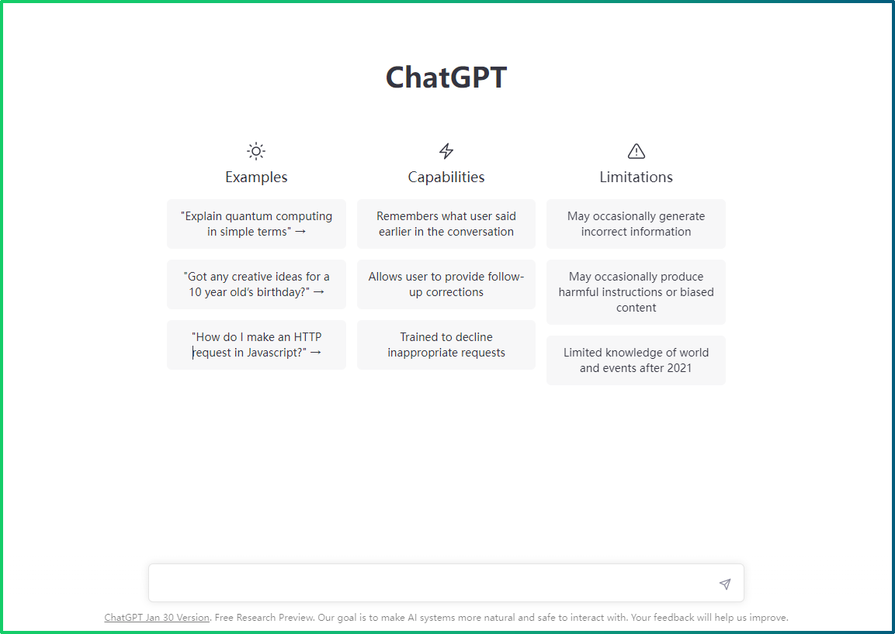
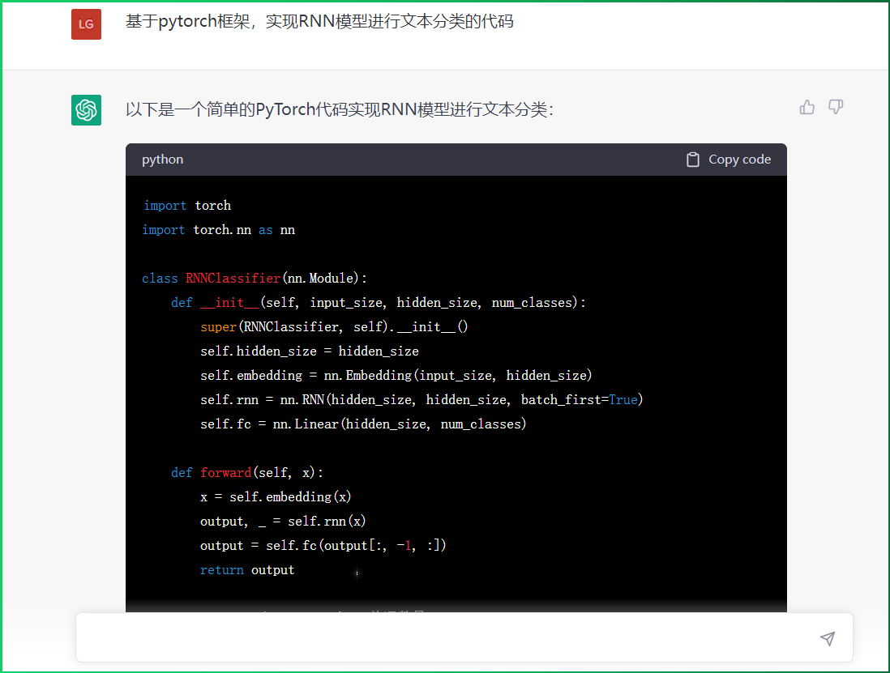
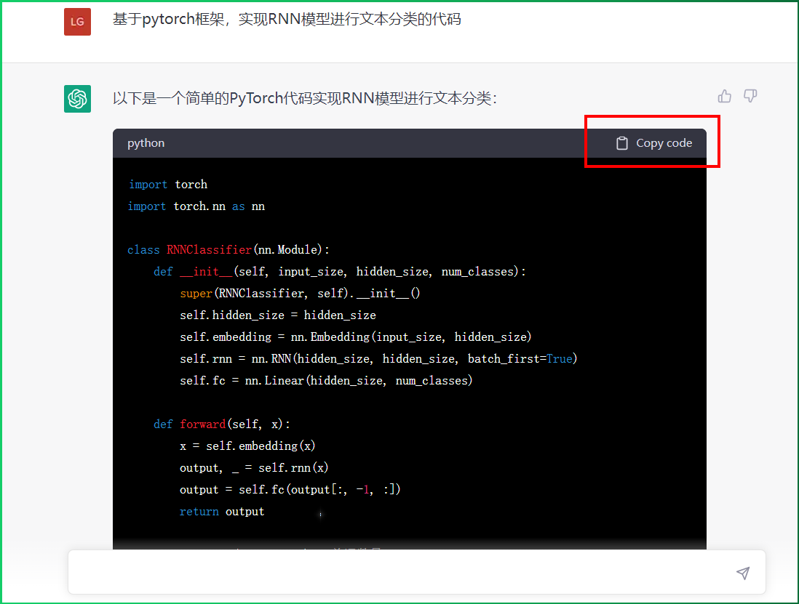
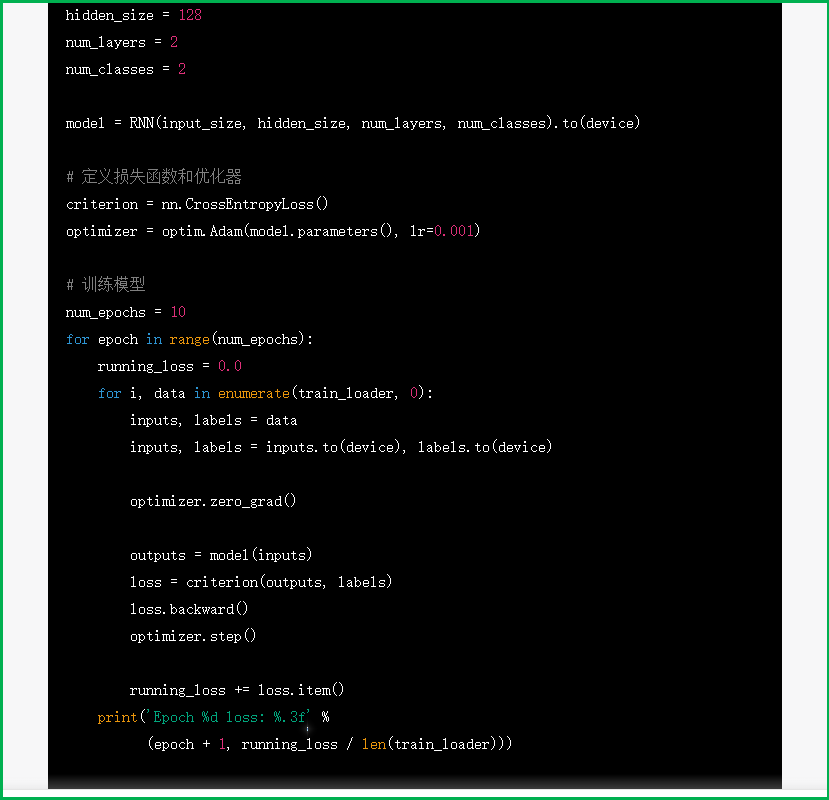
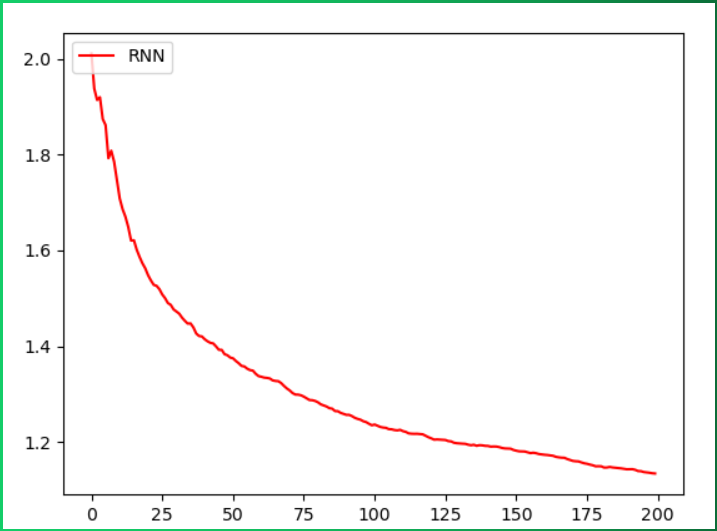
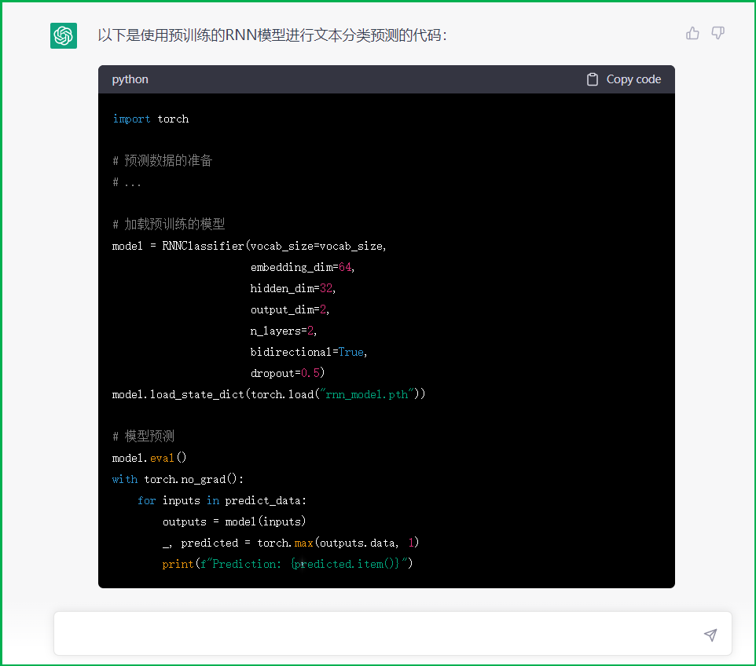

### 学习目标

* 了解有关人名分类问题和有关数据.
* 掌握使用ChatGPT实现RNN构建人名分类器的过程.

## 1 案例介绍


* 关于人名分类问题:
	
	以一个人名为输入, 使用模型帮助我们判断它最有可能是来自哪一个国家的人名, 这在某些国际化公司的业务中具有重要意义, 在用户注册过程中, 会根据用户填写的名字直接给他分配可能的国家或地区选项, 以及该国家或地区的国旗, 限制手机号码位数等等.

* 人名分类数据预览 


  * 数据存放路径：$(home)/data/name_classfication.txt
  * 数据格式说明 每一行第一个单词为人名，第二个单词为国家名。中间用制表符tab分割


```
Huffmann	German
Hummel	German
Hummel	German
Hutmacher	German
Ingersleben	German
Jaeger	German
Jager	German
Deng	Chinese
Ding	Chinese
Dong	Chinese
Dou	Chinese
Duan	Chinese
Eng	Chinese
Fan	Chinese
Fei	Chinese
Abaimov	Russian
Abakeliya	Russian
Abakovsky	Russian
Abakshin	Russian
Abakumoff	Russian
Abakumov	Russian
Abakumtsev	Russian
Abakushin	Russian
Abalakin	Russian
```

## 2  案例步骤

整个案例的实现可分为以下五个步骤


- 第一步导入必备的工具包
- 第二步对data文件中的数据进行处理，满足训练要求
- 第三步构建RNN模型(包括传统RNN, LSTM以及GRU)
- 第四步构建训练函数并进行训练
- 第五步构建预测函数并进行预测
  

### 2.1 导入必备的工具包

```python
# 导入torch工具
import torch
# 导入nn准备构建模型
import torch.nn as nn
import torch.nn.functional as F
import torch.optim as optim
# 导入torch的数据源 数据迭代器工具包
from  torch.utils.data import Dataset, DataLoader
# 用于获得常见字母及字符规范化
import string
# 导入时间工具包
import time
# 引入制图工具包  
import matplotlib.pyplot as plt
# 从io中导入文件打开方法
from io import open
```

### 2.2 数据预处理

这里需要对data文件中的数据进行处理，满足训练要求。

#### 1 获取常用的字符数量

```python
# 获取所有常用字符包括字母和常用标点
all_letters = string.ascii_letters + " .,;'"

# 获取常用字符数量
n_letters = len(all_letters)

print("n_letter:", n_letters)
```

> * 输出效果:

```
n_letter: 57
```


#### 2 国家名种类数和个数


```python
# 国家名 种类数
categorys = ['Italian', 'English', 'Arabic', 'Spanish', 'Scottish', 'Irish', 'Chinese', 'Vietnamese', 'Japanese',
             'French', 'Greek', 'Dutch', 'Korean', 'Polish', 'Portuguese', 'Russian', 'Czech', 'German']
# 国家名 个数
categorynum = len(categorys)
print('categorys--->', categorys)
```


> * 输出效果:

```python
categorys---> ['Italian', 'English', 'Arabic', 'Spanish', 'Scottish', 'Irish', 'Chinese', 'Vietnamese', 'Japanese', 'French', 'Greek', 'Dutch', 'Korean', 'Polish', 'Portuguese', 'Russian', 'Czech', 'German']
categorynum---> 18
```


#### 3 读数据到内存

```python
# 思路分析
# 1 打开数据文件 open(filename, mode='r', encoding='utf-8')
# 2 按行读文件、提取样本x 样本y line.strip().split('\t')
# 3 返回样本x的列表、样本y的列表 my_list_x, my_list_y
def read_data(filename):
    my_list_x, my_list_y= [], []
    # 打开文件
    with  open(filename, mode='r', encoding='utf-8') as f:
        # 按照行读数据
        for line in f.readlines():
            if len(line) <= 5:
                continue
            # 按照行提取样本x 样本y
            (x, y) = line.strip().split('\t')
            my_list_x.append(x)
            my_list_y.append(y)

    # 打印样本的数量
    print('my_list_x->', len(my_list_x))
    print('my_list_y->', len(my_list_y))

    # 返回样本x的列表、样本y的列表
    return my_list_x, my_list_y
```


#### 4 构建数据源NameClassDataset

```python
class NameClassDataset(Dataset):
    def __init__(self, my_list_x, my_list_y):

        # 样本x
        self.my_list_x = my_list_x

        # 样本y
        self.my_list_y = my_list_y

        # 样本条目数
        self.sample_len = len(my_list_x)

    # 获取样本条数
    def __len__(self):
        return self.sample_len

    # 获取第几条 样本数据
    def __getitem__(self, index):

        # 对index异常值进行修正 [0, self.sample_len-1]
        index = min(max(index, 0), self.sample_len-1)

        # 按索引获取 数据样本 x y
        x = self.my_list_x[index]
        y = self.my_list_y[index]

        # 样本x one-hot张量化
        tensor_x = torch.zeros(len(x), n_letters)
        # 遍历人名 的 每个字母 做成one-hot编码
        for li, letter in enumerate(x):
            # letter2indx 使用all_letters.find(letter)查找字母在all_letters表中的位置 给one-hot赋值
            tensor_x[li][all_letters.find(letter)] = 1

        # 样本y 张量化
        tensor_y = torch.tensor(categorys.index(y), dtype=torch.long)

        # 返回结果
        return tensor_x, tensor_y

```

> * 分析
>   * 文本张量化，这里也就是人名张量化是通过one-hot编码来完成。

```pyt
# 将字符串(单词粒度)转化为张量表示，如："ab" --->
# tensor([[[1., 0., 0., 0., 0., 0., 0., 0., 0., 0., 0., 0., 0., 0., 0., 0., 0.,
#          0., 0., 0., 0., 0., 0., 0., 0., 0., 0., 0., 0., 0., 0., 0., 0., 0.,
#          0., 0., 0., 0., 0., 0., 0., 0., 0., 0., 0., 0., 0., 0., 0., 0., 0.,
#          0., 0., 0., 0., 0., 0.]],

#        [[0., 1., 0., 0., 0., 0., 0., 0., 0., 0., 0., 0., 0., 0., 0., 0., 0.,
#          0., 0., 0., 0., 0., 0., 0., 0., 0., 0., 0., 0., 0., 0., 0., 0., 0.,
#          0., 0., 0., 0., 0., 0., 0., 0., 0., 0., 0., 0., 0., 0., 0., 0., 0.,
#          0., 0., 0., 0., 0., 0.]]])
```


#### 5 构建迭代器遍历数据

```python
def dm_test_NameClassDataset():

    # 1 获取数据
    myfilename = './data/name_classfication.txt'
    my_list_x, my_list_y = read_data(myfilename)
    print('my_list_x length', len(my_list_x))
    print('my_list_y length', len(my_list_y))

    # 2 实例化dataset对象
    nameclassdataset = NameClassDataset(my_list_x, my_list_y)

    # 3 实例化dataloader
    mydataloader = DataLoader(dataset=nameclassdataset, batch_size=1, shuffle=True)
    for  i, (x, y) in enumerate (mydataloader):
        print('x.shape', x.shape, x)
        print('y.shape', y.shape, y)
        break
```


> * 输出效果:

```
my_list_x length 20074
my_list_y length 20074
x.shape torch.Size([1, 5, 57]) tensor([[[0., 0., 0., 0., 0., 0., 0., 0., 0., 0., 0., 0., 0., 0., 0., 0., 0.,
          0., 0., 0., 0., 0., 0., 0., 0., 0., 1., 0., 0., 0., 0., 0., 0., 0.,
          0., 0., 0., 0., 0., 0., 0., 0., 0., 0., 0., 0., 0., 0., 0., 0., 0.,
          0., 0., 0., 0., 0., 0.],
         [0., 1., 0., 0., 0., 0., 0., 0., 0., 0., 0., 0., 0., 0., 0., 0., 0.,
          0., 0., 0., 0., 0., 0., 0., 0., 0., 0., 0., 0., 0., 0., 0., 0., 0.,
          0., 0., 0., 0., 0., 0., 0., 0., 0., 0., 0., 0., 0., 0., 0., 0., 0.,
          0., 0., 0., 0., 0., 0.],
         [1., 0., 0., 0., 0., 0., 0., 0., 0., 0., 0., 0., 0., 0., 0., 0., 0.,
          0., 0., 0., 0., 0., 0., 0., 0., 0., 0., 0., 0., 0., 0., 0., 0., 0.,
          0., 0., 0., 0., 0., 0., 0., 0., 0., 0., 0., 0., 0., 0., 0., 0., 0.,
          0., 0., 0., 0., 0., 0.],
         [0., 0., 0., 0., 0., 0., 0., 0., 0., 0., 0., 0., 0., 0., 0., 0., 0.,
          0., 0., 0., 0., 0., 0., 0., 0., 1., 0., 0., 0., 0., 0., 0., 0., 0.,
          0., 0., 0., 0., 0., 0., 0., 0., 0., 0., 0., 0., 0., 0., 0., 0., 0.,
          0., 0., 0., 0., 0., 0.],
         [1., 0., 0., 0., 0., 0., 0., 0., 0., 0., 0., 0., 0., 0., 0., 0., 0.,
          0., 0., 0., 0., 0., 0., 0., 0., 0., 0., 0., 0., 0., 0., 0., 0., 0.,
          0., 0., 0., 0., 0., 0., 0., 0., 0., 0., 0., 0., 0., 0., 0., 0., 0.,
          0., 0., 0., 0., 0., 0.]]])
y.shape torch.Size([1]) tensor([15])
```


### 2.3 构建RNN模型

#### 1  借助ChatGPT构建RNN模型

- 第一步：登录网址https://chat.openai.com/auth/login，打开ChatGPT聊天界面

<div align=center></div>

- 第二步：在对话框中输入：“基于pytorch框架，实现RNN模型进行文本分类的代码 “

<div align=center></div>

- 第三步：Cope code直接复制粘贴代码进行微调

<div align=center></div>

- 第四步：得到RNN实现人名分类的模型代码

```python
class RNNClassifier(nn.Module):
    def __init__(self, input_size, hidden_size, num_classes):
        super(RNNClassifier, self).__init__()
        self.hidden_size = hidden_size
        # 定义rnn层
        self.rnn = nn.RNN(input_size, hidden_size, batch_first=False)
        # 定义linear层
        self.fc = nn.Linear(hidden_size, num_classes)

    def forward(self, x, hidden):
        # 数据形状 [6,57] -> [6,1,57]
        input = x.unsqueeze(1)
        # 1 数据经过模型 提取事物特征
        # 数据形状 [seqlen,1,57],[1,1,128]) -> [seqlen,1,18],[1,1,128]
        rr, hn = self.rnn(input, hidden)
        # 数据形状 [seqlen,1,128] - [1, 128]  eg:[6,1,128] --> [1,128]
        tmprr = rr[-1]

        # 2 数据经过全连接层 [1,128] -->[1,18]
        tmprr = self.fc(tmprr)
        return tmprr

    def inithidden(self):
        # 初始化隐藏层输入数据 inithidden()
        return torch.zeros(1, 1, self.hidden_size)
```

> * torch.unsqueeze演示:

```
>>> x = torch.tensor([1, 2, 3, 4])
>>> torch.unsqueeze(x, 0)
tensor([[ 1,  2,  3,  4]])
>>> torch.unsqueeze(x, 1)
tensor([[ 1],
        [ 2],
        [ 3],
        [ 4]])
```

> * 调用:

```python
def dm01_test_myrnn():

    # 1 实例化rnn对象
    myrnn = RNNClassifier(57, 128, 18)
    print(f'myrnn的模型架构：{myrnn}')

    # 2 准备数据
    input = torch.randn(6, 57)
    print(input.shape)
    hidden = myrnn.inithidden()

    # 3 给模型输入数据
    # [seqlen, 57], [1, 1, 128]) -> [1,18], [1,1,128]
    output = myrnn(input, hidden)
    print('一次性的送数据：output->', output.shape, output)
```

> * 调用结果:

```python
myrnn---> RNN(
  (rnn): RNN(57, 128)
  (linear): Linear(in_features=128, out_features=18, bias=True)
  (softmax): LogSoftmax(dim=-1)
)
torch.Size([6, 57])
一次性的送数据：output-> torch.Size([1, 18]) tensor([[-2.8194, -3.1730, -3.3112, -2.9715, -3.0997, -2.8097, -2.8016, -2.8738,
         -2.7229, -2.8181, -2.7881, -3.0218, -2.9169, -2.6193, -2.8507, -2.9684,
         -2.8589, -2.8273]], grad_fn=<LogSoftmaxBackward0>)
```

### 2.4 构建训练函数并进行训练

#### 1 借助ChatGPT构建RNN训练函数

- （接上面模型构建完毕的代码之后）在ChatGPT对话框中输入：“模型训练代码如何实现”？下图是ChatGPT给的结果展示：

<div align=center></div>

- ChatGPU输出代码

<div align=center></div>

- 上述代码微调实现训练：

```python
# 模型训练参数
mylr = 1e-3
epochs = 5

def dm_train_rnn():
    # 从文件获取数据
    filename = './data/name_classfication.txt'
    my_list_x, my_list_y = read_data(filename)
    
    # 实例化数据源对象nameclassdataset
    nameclassdataset = NameClassDataset(my_list_x, my_list_y)
    
    # 实例化 模型
    input_size = 57
    n_hidden = 128
    num_classes = 18
    my_rnn = RNNClassifier(input_size, n_hidden, num_classes)
    
    # 损失函数对象mycrossentropyloss=nn.NLLLoss() 优化器对象myadam
    mycrossentropyloss = nn.CrossEntropyLoss()
    myadam = optim.Adam(my_rnn.parameters(), lr=mylr)
    
    # 定义模型训练的参数:
    starttime = time.time()
    total_iter_num = 0
    total_loss = 0
    total_loss_list = []
    total_acc_num = 0
    total_acc_list = []
    # 外层for循环 控制轮数 for epoch_idx in range(epochs)
    for epoch_idx in range(epochs):
    # 内层for循环 控制迭代次数 for i, (x, y) in enumerate(mydataloader)
        mydataloader = DataLoader(dataset=nameclassdataset, batch_size=1, shuffle=True)
        for i, (x, y) in enumerate(mydataloader):
            # 给模型喂数据
            output = my_rnn(x[0], my_rnn.inithidden())
            # 计算损失
            myloss = mycrossentropyloss(output, y)
            # 梯度清零
            myadam.zero_grad()
            # 反向传播
            myloss.backward()
            # 梯度更新
            myadam.step()

			# 累加总损失和准确数 每 总体平均准确率
            total_iter_num += 1
            total_loss = total_loss + myloss.item()
            acc_num = 1 if torch.argmax(output).item() == y.item() else 0
            total_acc_num = total_acc_num + acc_num
            
            # 每100次训练计算一个总体平均损失
            if total_iter_num % 100 == 0:
                avg_loss = total_loss / total_iter_num
                total_loss_list.append(avg_loss)
                avg_acc = total_acc_num / total_iter_num
                total_acc_list.append(avg_acc)
                
            # 2000次训练 打印日志
            if total_iter_num % 2000 == 0:
                avg_loss1 = total_loss / total_iter_num
                avg_acc1 = total_acc_num / total_iter_num
                print('轮次:%d, 损失:%.6f, 时间:%d，准确率:%.3f'% (epoch_idx, avg_loss1, time.time()-starttime, avg_acc1))
        torch.save(my_rnn.state_dict(), './my_rnn_20230206_%s.bin' % (epoch_idx+1))
    total_time = int(time.time() - starttime)
    return total_loss_list, total_time, total_acc_list

```


#### 2 模型训练并制图

```python
def dm_test_train_rnn():
    total_loss_list, total_time, total_acc_list = dm_train_rnn()
    #绘制损失曲线图
    plt.figure(0)
    plt.plot(total_loss_list, color='red', label='RNN')
    plt.legend(loc='upper left')
    plt.savefig('./rnn_loss_picture.png')
    plt.show()
```

> * RNN模型训练日志输出:

```python
轮次:3, 损失:0.963966, 时间:160，准确率:0.711
轮次:3, 损失:0.957188, 时间:165，准确率:0.713
轮次:3, 损失:0.953401, 时间:170，准确率:0.714
轮次:3, 损失:0.949682, 时间:176，准确率:0.715
轮次:3, 损失:0.945195, 时间:181，准确率:0.716
轮次:3, 损失:0.941764, 时间:186，准确率:0.717
轮次:3, 损失:0.937678, 时间:191，准确率:0.718
轮次:3, 损失:0.935359, 时间:196，准确率:0.719
轮次:3, 损失:0.932477, 时间:201，准确率:0.720
轮次:3, 损失:0.930199, 时间:206，准确率:0.721
轮次:4, 损失:0.925508, 时间:212，准确率:0.722
轮次:4, 损失:0.922058, 时间:217，准确率:0.723
轮次:4, 损失:0.918828, 时间:223，准确率:0.724
轮次:4, 损失:0.916118, 时间:228，准确率:0.725
轮次:4, 损失:0.914868, 时间:233，准确率:0.725
轮次:4, 损失:0.912617, 时间:238，准确率:0.725
轮次:4, 损失:0.909797, 时间:244，准确率:0.726
轮次:4, 损失:0.907370, 时间:249，准确率:0.727
轮次:4, 损失:0.906036, 时间:254，准确率:0.727
```

> - RNN模型训练损失曲线图

<div align=center></div>


### 2.5 构建预测函数并进行预测

#### 1 借助ChatGPT构建RNN预测函数

- （接上面模型训练代码之后）在ChatGPT对话框中输入：“模型预测代码如何实现”？下图是ChatGPT给的结果展示：

<div align=center></div>

- ChatGPT给出预测代码：

<div align=center></div>

- 上述代码微调并实现模型预测：

```python
# 将人名转化为onehot张量
# eg 'bai' --> [3,57]
def lineToTensor(x):
    # 文本张量化x
    tensor_x = torch.zeros(len(x), n_letters)
    # 遍历这个人名中的每个字符索引和字符
    for li, letter in enumerate(x):
        # letter在字符串all_letters中的位置 就是onehot张量1索引的位置
        # letter在字符串all_letters中的位置 使用字符串find()方法获取
        tensor_x[li][all_letters.find(letter)] = 1
    return tensor_x
```


```python
def my_predict_rnn(x):
    n_letters = 57
    n_hidden = 128
    n_categories = 18
    # 1 输入文本数据 张量化one-hot
    tensor_x = line_to_tensor(x)
    # 2 实例化模型 加载已训练模型参数 m.load_state_dict(torch.load(my_path_rnn))
    my_rnn = RNNClassifier(n_letters, n_hidden, n_categories)
    my_rnn.load_state_dict(torch.load('./my_rnn_20230206_5.bin'))
    # 3 模型预测 
    my_rnn.eval()
    with torch.no_grad():
        # # 4 从预测结果中取出前1名,显示打印结果 output.topk(1, 1, True)
        output = my_rnn(tensor_x, my_rnn.inithidden())
        topv, topi = output.topk(1, 1, True)
        value = topv[0][0]
        category_index = topi[0][0]
        categ = categorys[category_index]
        print('\t value:%d  category:%s' % (value, categ))
```


#### 2 构建RNN预测调用函数

```python
def dm_test_predic_rnnu():
		# 把三个函数的入口地址 组成列表，统一输入数据进行测试
    for func in [my_predict_rnn]:
        func('lucy')
```

> * 输出效果

```python
value:2  category:English
```


## 3 小结

* 学习了关于人名分类问题:
	以一个人名为输入, 使用模型帮助我们判断它最有可能是来自哪一个国家的人名, 这在某些国际化公司的业务中具有重要意义, 在用户注册过程中, 会根据用户填写的名字直接给他分配可能的国家或地区选项, 以及该国家或地区的国旗, 限制手机号码位数等等.

* 人名分类器的实现可分为以下五个步骤:
	* 第一步: 导入必备的工具包
	* 第二步: 对data文件中的数据进行处理，满足训练要求
	* 第三步: 构建RNN模型(包括传统RNN, LSTM以及GRU)
	* 第四步: 构建训练函数并进行训练
	* 第五步: 构建评估函数并进行预测


* 第一步: 导入必备的工具包
  * python版本使用3.7.x, pytorch版本使用1.6.1
* 第二步: 对data文件中的数据进行处理，满足训练要求
  * 读原始数据到内存，构建出模型需要的数据x，标签y，然后把数据转成数据源，最后再封装成数据迭代器
  * 从编程实现来看，文本数值化，数值张量化是通过one-hot编码一步完成的
* 第三步: 构建RNN模型
  * 构建传统的RNN模型的类class RNN.
* 第四步: 构建训练函数并进行训练
  * 实例化数据迭代器对象
  * 实例化模型对象、损失函数对象、优化器对象
  * 定义模型训练的参数
  * 训练模型
    * 外层for循环 控制轮数
    * 内层for循环 控制迭代次数，给模型喂数据，计算损失 ，梯度清零 ，反向传播 ， 梯度更新，打印日志
  *  模型保存
* 第五步: 构建预测函数并进行预测
  * 构建传统RNN预测函数
  * 构建预测函数调用函数