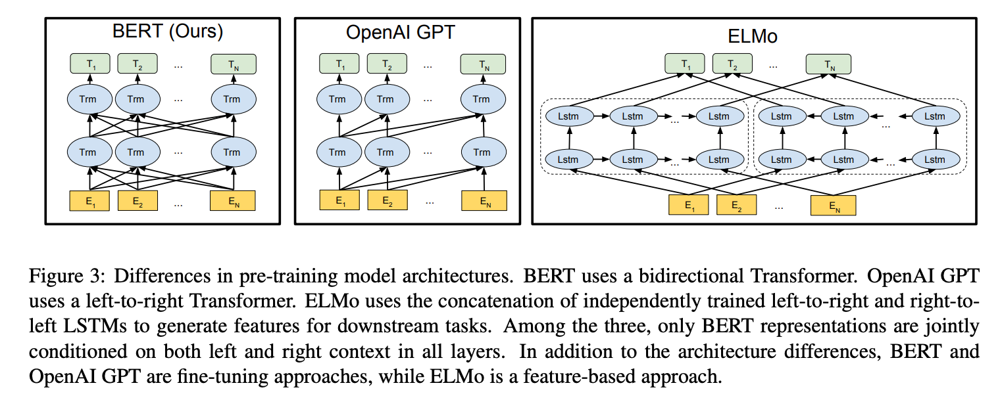

201810月11日，Google AI Language 发布了论文 BERT: Pre-training of Deep Bidirectional Transformers for Language Understanding(https://arxiv.org/pdf/1810.04805.pdf)    
Bert结构是在transformer模型的基础上（只用了左边的图），增加了句子之间的关系，和句子内词之间的关系来提取特征，进行词向量的训练  

模型创新：  
1.双向上下文信息  
2.pretrain+finetune的兴起  

模型细节：  
采用多任务模式  
1.MLM在句子中添加掩码，来预测这个掩码的词  
2.NSP两个句子是否是上下文，是为1，不是为0进行预测，50%对的，50%从语料库中抽取  

掩码的添加规则  
句子中15%的词会被掩码替代,finetune时，输入不用masked，为了缓解这种差异，进行百分比masked，  
1.15%的词中80%的概率被mask替代  
2.15%的词中10%的概率不变  
3.15%的词中10%的概率用其他词代替   

bert的输入数据通过3个信息相加  

1.词向量序列，token    
2.句子信息，segment     
3.位置信息，position，可训练，随机初始化或加上用户输入的ids     

激活函数，gelu，(GaussianErrorLinearUnits高斯误差线性单元）  

baseline  
Bert_BASE :Layer = 12, Hidden = 768,  Head = 12, 每个head是64纬, Total Parameters = 110M  
Bert_LARGE:Layer = 24, Hidden = 1024, Head = 16, 每个head是64纬, Total Parameters = 340M  

输出  
1.sequence output  
2.polled->cls+liner+tanch/nsp任务  

FFN，FeedForwardNetwork  
linear2(dropout(GELU(linear1(x))))  
1.linear，768->2048  
2.GELU(在transformer中用的是RELU(线性整流函数，修正线性单元)，GPT中FFN是卷积)  
3.dropout  
4.linear,2048->768  

FFN作用  
1.增加参数，增强模型拟合能力  
2.相当于对字embedding加入参数，增强自己字内部的信息，从768-2048-768只是单个字内不得embedding-size变化  

bert结构  

  
bert问题  
bert的缺点  
1.finetune时输入无需mask，导致暴露偏差，为了缓解，采用百分比mask的策略  
2.训练时，maksed之间的词是相互独立的，这是假设，其实不是  
  
bert对比  
CBOW和MLM的区别：  
两者都是根据上下文预测中间词，CBOW有context，window，MLM没有限制

bert变种
RoBerTa，模型大，动态mask(每个epoch不同mask)
ALBERT，参数量小，跨层参数共享
1.减少了参数，训练速度提升，但是因为大部分是共享参数，inference并没有加速
(1)在字embedding的时候，做因式分解，v*h 改为 v*e+e*h
(2)参数共享，吧每层的参数进行共享，3种模式，只共享attention，只共享ffn，全部共享
2.吧nsp任务去掉，加入了sop sentence order prediction  句子顺序预测
BERT-WWM，哈工大/讯飞，mask全词，中文
ERINE，百度，mask实体，中文
SpanBERT，随机选取span进行mask
TinyBERT，对transformer蒸馏
SentenceBERT，孪生网络
K-BERT，腾讯，图谱
XLNET，既保持LM，又想要上下文信息，预测第i个词时，从上下文随机选i-1个词attention

elmo/gpt/bert对比
elmo，Bilstm+LM，feature-based(固定elmo权重)  
gpt，transformer-decoder部分，含有sequence-mask，去掉中间的encoder-decoder-attention，fine-tuning
bert，transformer-encoder部分，无sequence-mask，fine-tuning

  

<table class="MsoTableGrid" border="1" cellspacing="0" cellpadding="0" width="563" style="width:422.1pt;border-collapse:collapse;border:none;mso-border-alt:solid windowtext .5pt;
 mso-yfti-tbllook:1184;mso-padding-alt:0cm 5.4pt 0cm 5.4pt">
 <tbody><tr style="mso-yfti-irow:0;mso-yfti-firstrow:yes;height:20.8pt">
  <td width="141" valign="top" style="width:105.5pt;border:solid windowtext 1.0pt;
  mso-border-alt:solid windowtext .5pt;padding:0cm 5.4pt 0cm 5.4pt;height:20.8pt">
  
<o:p>&nbsp;</o:p>

  </td>
  <td width="161" valign="top" style="width:121.05pt;border:solid windowtext 1.0pt;
  border-left:none;mso-border-left-alt:solid windowtext .5pt;mso-border-alt:
  solid windowtext .5pt;padding:0cm 5.4pt 0cm 5.4pt;height:20.8pt">
  
优点

  </td>
  <td width="180" valign="top" style="width:134.7pt;border:solid windowtext 1.0pt;
  border-left:none;mso-border-left-alt:solid windowtext .5pt;mso-border-alt:
  solid windowtext .5pt;padding:0cm 5.4pt 0cm 5.4pt;height:20.8pt">
  
缺点

  </td>
  <td width="81" valign="top" style="width:60.85pt;border:solid windowtext 1.0pt;
  border-left:none;mso-border-left-alt:solid windowtext .5pt;mso-border-alt:
  solid windowtext .5pt;padding:0cm 5.4pt 0cm 5.4pt;height:20.8pt">
  
GELU表现

  </td>
 </tr>
 <tr style="mso-yfti-irow:1;height:42.35pt">
  <td width="141" valign="top" style="width:105.5pt;border:solid windowtext 1.0pt;
  border-top:none;mso-border-top-alt:solid windowtext .5pt;mso-border-alt:solid windowtext .5pt;
  padding:0cm 5.4pt 0cm 5.4pt;height:42.35pt">
  
ELMO

  </td>
  <td width="161" valign="top" style="width:121.05pt;border-top:none;border-left:
  none;border-bottom:solid windowtext 1.0pt;border-right:solid windowtext 1.0pt;
  mso-border-top-alt:solid windowtext .5pt;mso-border-left-alt:solid windowtext .5pt;
  mso-border-alt:solid windowtext .5pt;padding:0cm 5.4pt 0cm 5.4pt;height:42.35pt">
  
动态词向量

  </td>
  <td width="180" valign="top" style="width:134.7pt;border-top:none;border-left:
  none;border-bottom:solid windowtext 1.0pt;border-right:solid windowtext 1.0pt;
  mso-border-top-alt:solid windowtext .5pt;mso-border-left-alt:solid windowtext .5pt;
  mso-border-alt:solid windowtext .5pt;padding:0cm 5.4pt 0cm 5.4pt;height:42.35pt">
  
双向只是单纯的concat两个lstm，并没有真正的双向

  </td>
  <td width="81" valign="top" style="width:60.85pt;border-top:none;border-left:
  none;border-bottom:solid windowtext 1.0pt;border-right:solid windowtext 1.0pt;
  mso-border-top-alt:solid windowtext .5pt;mso-border-left-alt:solid windowtext .5pt;
  mso-border-alt:solid windowtext .5pt;padding:0cm 5.4pt 0cm 5.4pt;height:42.35pt">
  
最差

  </td>
 </tr>
 <tr style="mso-yfti-irow:2;height:41.55pt">
  <td width="141" valign="top" style="width:105.5pt;border:solid windowtext 1.0pt;
  border-top:none;mso-border-top-alt:solid windowtext .5pt;mso-border-alt:solid windowtext .5pt;
  padding:0cm 5.4pt 0cm 5.4pt;height:41.55pt">
  
GPT

  </td>
  <td width="161" valign="top" style="width:121.05pt;border-top:none;border-left:
  none;border-bottom:solid windowtext 1.0pt;border-right:solid windowtext 1.0pt;
  mso-border-top-alt:solid windowtext .5pt;mso-border-left-alt:solid windowtext .5pt;
  mso-border-alt:solid windowtext .5pt;padding:0cm 5.4pt 0cm 5.4pt;height:41.55pt">
  
文本生成表现出色，同时采用辅助目标函数和LM

  </td>
  <td width="180" valign="top" style="width:134.7pt;border-top:none;border-left:
  none;border-bottom:solid windowtext 1.0pt;border-right:solid windowtext 1.0pt;
  mso-border-top-alt:solid windowtext .5pt;mso-border-left-alt:solid windowtext .5pt;
  mso-border-alt:solid windowtext .5pt;padding:0cm 5.4pt 0cm 5.4pt;height:41.55pt">
  
单向的transformer结构，无法利用上下文信息

  </td>
  <td width="81" valign="top" style="width:60.85pt;border-top:none;border-left:
  none;border-bottom:solid windowtext 1.0pt;border-right:solid windowtext 1.0pt;
  mso-border-top-alt:solid windowtext .5pt;mso-border-left-alt:solid windowtext .5pt;
  mso-border-alt:solid windowtext .5pt;padding:0cm 5.4pt 0cm 5.4pt;height:41.55pt">
  
较差

  </td>
 </tr>
 <tr style="mso-yfti-irow:3;mso-yfti-lastrow:yes;height:53.4pt">
  <td width="141" valign="top" style="width:105.5pt;border:solid windowtext 1.0pt;
  border-top:none;mso-border-top-alt:solid windowtext .5pt;mso-border-alt:solid windowtext .5pt;
  padding:0cm 5.4pt 0cm 5.4pt;height:53.4pt">
  
BERT

  </td>
  <td width="161" valign="top" style="width:121.05pt;border-top:none;border-left:
  none;border-bottom:solid windowtext 1.0pt;border-right:solid windowtext 1.0pt;
  mso-border-top-alt:solid windowtext .5pt;mso-border-left-alt:solid windowtext .5pt;
  mso-border-alt:solid windowtext .5pt;padding:0cm 5.4pt 0cm 5.4pt;height:53.4pt">
  
各项任务表现最好，采用MLM的实现形式，完成真正意义上的的双向，增加了句子级别的预测任务

  </td>
  <td width="180" valign="top" style="width:134.7pt;border-top:none;border-left:
  none;border-bottom:solid windowtext 1.0pt;border-right:solid windowtext 1.0pt;
  mso-border-top-alt:solid windowtext .5pt;mso-border-left-alt:solid windowtext .5pt;
  mso-border-alt:solid windowtext .5pt;padding:0cm 5.4pt 0cm 5.4pt;height:53.4pt">
  
在文本生成任务上表现不佳

  </td>
  <td width="81" valign="top" style="width:60.85pt;border-top:none;border-left:
  none;border-bottom:solid windowtext 1.0pt;border-right:solid windowtext 1.0pt;
  mso-border-top-alt:solid windowtext .5pt;mso-border-left-alt:solid windowtext .5pt;
  mso-border-alt:solid windowtext .5pt;padding:0cm 5.4pt 0cm 5.4pt;height:53.4pt">
  
最好

  </td>
 </tr>
</tbody></table>

<o:p>&nbsp;</o:p>

