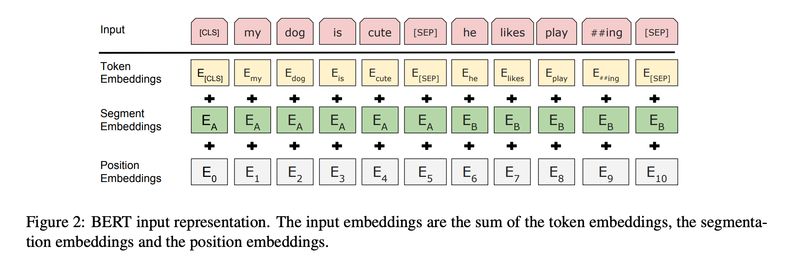
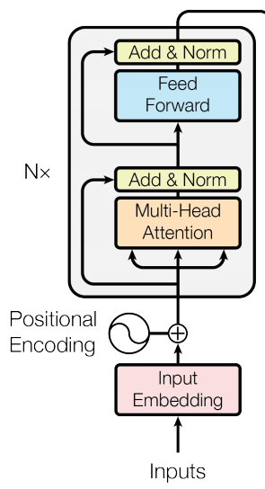
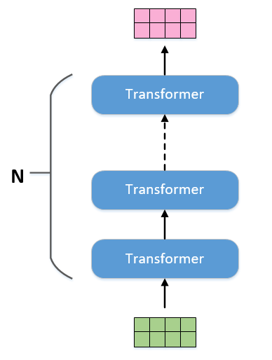

201810月11日，Google AI Language 发布了论文 BERT: Pre-training of Deep Bidirectional Transformers for Language Understanding(https://arxiv.org/pdf/1810.04805.pdf)    
Bert结构是在transformer模型的基础上（只用了左边的图），增加了句子之间的关系，和句子内词之间的关系来提取特征，进行词向量的训练  

模型创新：  
1.双向上下文信息  
2.pretrain+finetune的兴起  

模型细节：  
采用多任务模式  
1.MLM在句子中添加掩码，来预测这个掩码的词  
2.NSP两个句子是否是上下文，是为1，不是为0进行预测，50%对的，50%从语料库中抽取  

掩码的添加规则  
句子中15%的词会被掩码替代,finetune时，输入不用masked，为了缓解这种差异，进行百分比masked，  
1.15%的词中80%的概率被mask替代  
2.15%的词中10%的概率不变  
3.15%的词中10%的概率用其他词代替   

bert的输入数据通过3个信息相加  

1.词向量序列，token    
2.句子信息，segment     
3.位置信息，position，可训练，随机初始化或加上用户输入的ids     

激活函数，gelu，(GaussianErrorLinearUnits高斯误差线性单元）  

baseline  
Bert_BASE :Layer = 12, Hidden = 768,  Head = 12, 每个head是64纬, Total Parameters = 110M  
Bert_LARGE:Layer = 24, Hidden = 1024, Head = 16, 每个head是64纬, Total Parameters = 340M  

输出  
1.sequence output  
2.polled->cls+liner+tanch/nsp任务  

FFN，FeedForwardNetwork  
linear2(dropout(GELU(linear1(x))))  
1.linear，768->2048  
2.GELU(在transformer中用的是RELU，GPT中FFN是卷积)  
3.dropout  
4.linear,2048->768  

FFN作用  
1.增加参数，增强模型拟合能力  
2.相当于对字embedding加入参数，增强自己字内部的信息，从768-2048-768只是单个字内不得embedding-size变化  

bert结构  

  
bert问题  
bert的缺点  
1.finetune时输入无需mask，导致暴露偏差，为了缓解，采用百分比mask的策略  
2.训练时，maksed之间的词是相互独立的，这是假设，其实不是  
  
bert对比  
CBOW和MLM的区别:  
两者都是根据上下文预测中间词，CBOW有context，window，MLM没有限制