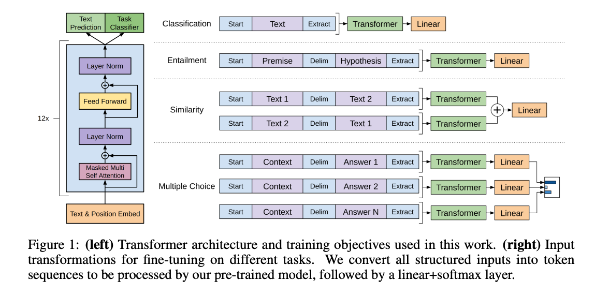

2018年，openAI，Generative Pre-Training  
gpt1，12层，117M，https://cdn.openai.com/research-covers/language-unsupervised/language_understanding_paper.pdf  
gpt2，48层，1542M，1600维度，https://d4mucfpksywv.cloudfront.net/better-language-models/language-models.pdf  
gpt3，96层，175000M，12888维度，https://arxiv.org/pdf/2005.14165.pdf  
缺点，自回归，没用全局信息，只用ti之前的信息  
  
意义  
1.提出了，language model+pretrain  
2.提出了，pretrain+finetuning的训练方法  
finetune时，下游任务loss和gpt的loss相结合  
  
gpt1，12层，transformer的decoder  

    
  
gpt2，12层  
1.去掉了finetune层，自动识别什么任务  
2.增加了数据集  
3.增加了模型擦数，1542M  
4.调整了模型结构，layerNormalization提前  
