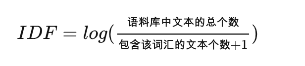

TFIDF  
理解  
为了分析某个词语在文章中的权重  
用以评估一字词对于一个文件集或一个语料库中的其中一份文件的重要程度。字词的重要性随着它在文件中出现的次数成正比增加，但同时会随着它在语料库中出现的频率成反比下降  
https://zhuanlan.zhihu.com/p/113017752

TF(term frequency)：  
词在文章中出现的频率。它的计算要依据个人的情况而定，只要保证这个TF能表示词在文章的频率就行  

  

IDF(inverse document frequency):  
IDF = 文章总数/包含该词的文档数  

  

  

如何用tfidf计算2个句子的相关性？  
一个用户问题与一个标准问题的TF-IDF相似度，是将用户问题中每一词与标准问题计算得到的TF-IDF值求和。  
计算句子a和句子b的相关性，可以把a和b进行切词，在a中的词，如果也在b中，那么计算此词在b的tfidf(idf计算的是含有b的文档库)，得分进行相加 

 

BM25  
BM25算法是TF-IDF算法的优化，BM 是Best Match最佳匹配的缩写，25指的是第25次算法迭代  
https://zhuanlan.zhihu.com/p/79202151  
1.query中每个单词  与文档d之间的相关性   
2.单词  与query之间的相似性   
3.每个单词的权重   

  