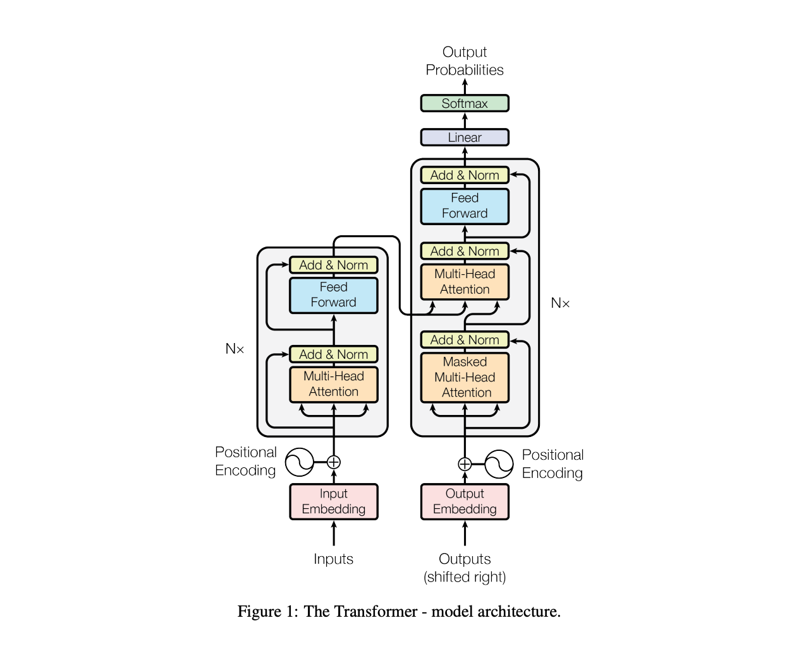
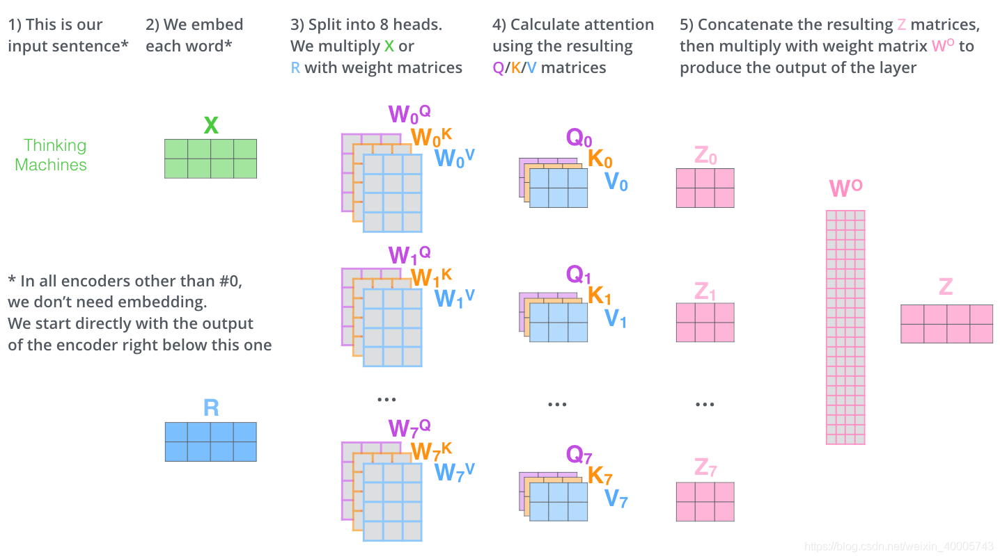
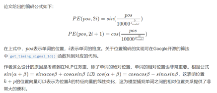

Transformer是谷歌在2017年6月论文 Attention is all you need发布的一个用来替代RNN和CNN的新的网络结构https://arxiv.org/pdf/1706.03762.pdf   
本质上就是一个Attention结构，它能够直接获取全局的信息，而不像RNN需要逐步递归才能获得全局信息，也不像CNN只能获取局部信息，并且其能够进行并行运算  
  
模型意义  
1.非序列化模型  
2.为pre-train model打下基础  
  
attention操作  
1.点积，transformer中用的是scaled Dot-product attention  
2.加法  
3.乘法  
  
attention-mask  
1.sequence-mask 防止decoder中看到未来信息，下三角矩阵  
2.padding-mask attention时处理pad为0的值，softmax时，pad=0用一个很小的值代替，softmax后接近0  
  
MultiHeadAttention  

  
Q,K,V分别切成H个头，得到H个attention的结果后再concat  

en-en，Q(en-in),K(en-in),V(en-in),self-attention   
en-de，Q(de-in),K(en-in),V(en-in),cross self-attention   
de-de，Q(de-in),K(de-in),V(de-in),masked self-attention   

  
结构  
原始transformer中的隐层向量维度hidden_size=d_model=512，multihead个数n_head=8；而bert中hidden_size=d_model=768，multihead个数n_head=12  
6个encoder，6个decoder  

  
  
FFN，feed forward network  
两层，可用线性也可用卷积  
激活是relu  
  
layer normalization  
v11，v12，v13，v14  <---layerNormalization横向计算，mean，std，进行归一化，是对hidden-size的纬度进行归一化     
v21，v22，v23，v24  
v31，v32，v33，v34  
^ --batc  hNormalization,竖向计算，mean，std，进行归一化     

问题  
为什么除以dk  
因为在softmax的分量增大时，最大那个值的softmax后的结果更接近1，此时在反向传播时，梯度很接近0，会造成梯度消失，不利于训练，所以是要将每个分量的值降低，就是取除以dk  

multi-head-attention的作用  
自注意力机制的基础上又加了一个多头注意力机制，这个机制从两个方面增强了注意力层的表现：  
(1)增加了模型将注意力集中在多个不同位置的能力  
(2)muti-headed attention可以使我们拥有多组的 Query/Key/Value 权重矩阵（论文中是8组）。每一组都随机初始化经过训练之后，能够将输入的词向量转化为具有不同代表意义的子空间（different representation subspace）
多头之后，通过一个w0的矩阵将多个z压缩成1个  

   

位置编码  
位置编码的定义有多种，其中一种是绝对位置编码（gpt、bert使用），还有相对位置编码（transformer原始论文使用）。  
截止目前为止，我们介绍的Transformer模型并没有捕捉顺序序列的能力，也就是说无论句子的结构怎么打乱，Transformer都会得到类似的结果。换句话说，Transformer只是一个功能更强大的词袋模型而已。  
为了解决这个问题，论文中在编码词向量时引入了位置编码（Position Embedding）的特征。具体地说，位置编码会在词向量中加入了单词的位置信息，这样Transformer就能区分不同位置的单词了。  
那么怎么编码这个位置信息呢？常见的模式有：a. 根据数据学习；b. 自己设计编码规则。在这里作者采用了第二种方式。那么这个位置编码该是什么样子呢？通常位置编码是一个长度为d_modeldmodel的特征向量  

   
位置编码演变     
1．Pos=0，1，2，3，4，5…T     
问题     
(1)	句子过长时，最后一个比第一个差值太大，和字嵌入合并后会有数值上的倾斜     
(2)	句子过长，位置编码值过大时，会比字嵌入的数值大，影响字嵌入信息     
2．Pos/T     
问题     
不同长度的文本，步长不同（相邻2个字的差值不同）     
3．用sin/cos周期函数，sin(pos/a)     
问题：会有重复值     
4. 用sin/cos周期函数，不同维度用不同函数