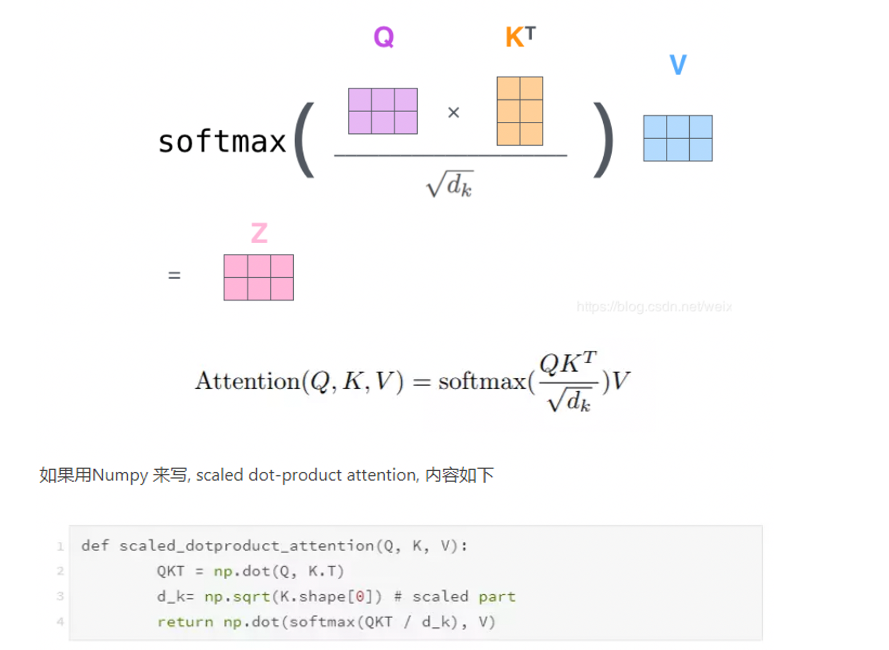
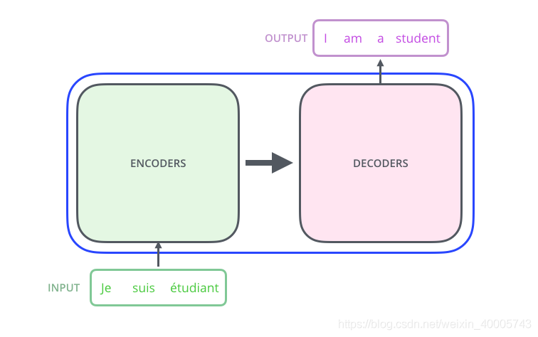
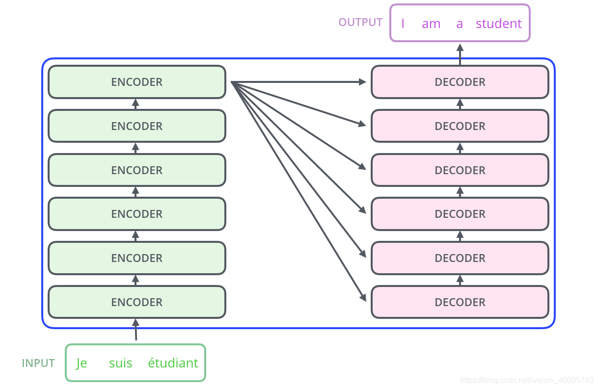
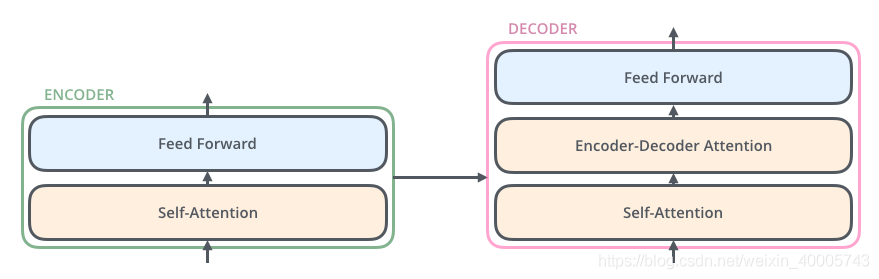
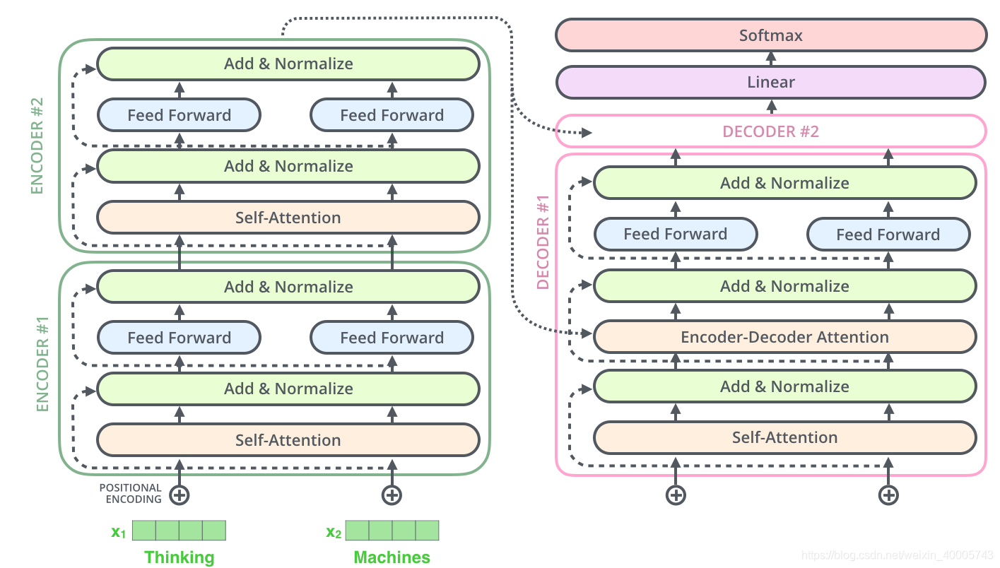

Transformer是谷歌在2017年6月论文 Attention is all you need发布的一个用来替代RNN和CNN的新的网络结构，
本质上就是一个Attention结构，它能够直接获取全局的信息，而不像RNN需要逐步递归才能获得全局信息，也不像CNN只能获取局部信息，并且其能够进行并行运算

模型意义
1.非序列化模型
2.为pre-train model打下基础

attention操作
1.点积，transformer中用的是scaled Dot-product attention
2.加法
3.乘法

attention-mask
1.sequence-mask 防止decoder中看到未来信息，下三角矩阵
2.padding-mask attention时处理pad为0的值，softmax时，pad=0用一个很小的值代替，softmax后接近0

MultiHeadAttention

Q,K,V分别切成H个头，得到H个attention的结果后再concat
en-en，Q(en-in),K(en-in),V(en-in),
en-de，Q(de-in),K(en-in),V(en-in),
de-de，Q(de-in),K(de-in),V(de-in),

结构
6个encoder，6个decoder

FFN，feed forward network
两层，可用线性也可用卷积
激活是relu

layer normalization
v11，v12，v13，v14  <---layerNormalization横向计算，mean，std，进行归一化
v21，v22，v23，v24
v31，v32，v33，v34
^ --batc  hNormalization,竖向计算，mean，std，进行归一化