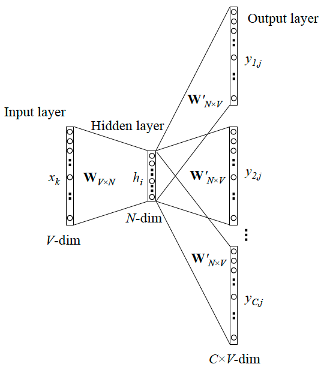
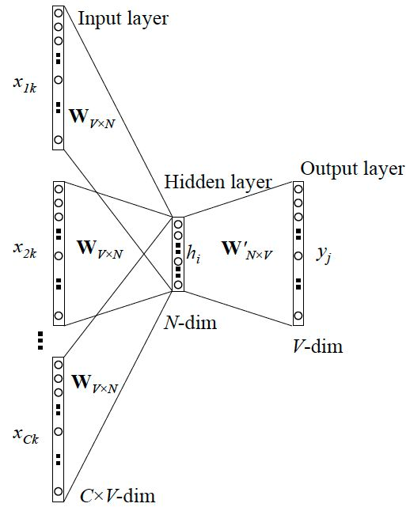

word2vec是Google研究团队里的Tomas Mikolov等人于2013年的《Distributed Representations ofWords and Phrases and their Compositionality》
以及后续的《Efficient Estimation of Word Representations in Vector Space》两篇文章中提出的
一种高效训练词向量的模型，基本出发点和Distributed representation类似:上下文相似的两个词，它们的词向量也应该相似，
比如香蕉和梨在句子中可能经常出现在相同的上下文中，因此这两个词的表示向量应该就比较相似
https://zhuanlan.zhihu.com/p/422220941

跳字模型（skip-gram）：  
用当前词来预测上下文。相当于给你一个词，让你猜前面和后面可能出现什么词。  
连续词袋模型（CBOW，continuous bag of words）：  
通过上下文来预测当前值。相当于一句话中扣掉一个词，让你猜这个词是什么。  

两种训练加速方法：  
负采样  
层次softmax  

skip-gram  

  

cbow  

  

