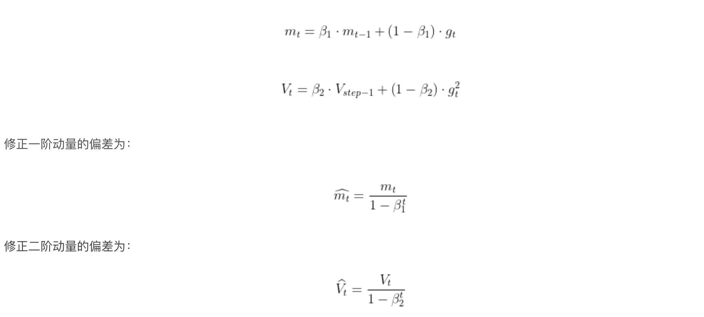

https://blog.csdn.net/m0_46568930/article/details/111826364?spm=1001.2101.3001.6650.2&utm_medium=distribute.pc_relevant.none-task-blog-2%7Edefault%7ECTRLIST%7Edefault-2-111826364-blog-122496183.pc_relevant_blogantidownloadv1&depth_1-utm_source=distribute.pc_relevant.none-task-blog-2%7Edefault%7ECTRLIST%7Edefault-2-111826364-blog-122496183.pc_relevant_blogantidownloadv1&utm_relevant_index=5  
一、优化算法一般步骤  
1.计算梯度  
2.算t时刻的一阶动量mt（与梯度相关的函数）和二阶动量Vt（与梯度平方相关的函数）  
3.当前时刻的下降梯度  
4.更新t+1时刻参数  

  
  
二、sgd，Stochastic Gradient Descent  
mt=gt，vt=1  
  
三、SGDM，momentum，在sgd的基础上增加1阶动量  

  
  
四、BGD，Batch Gradient Descent  
通过计算参数关于整个训练集的损失函数的梯度  
  
  
五、MBGD，Mini-batch Gradient Descent  
同时兼顾了上述sgd和mgd方法的优势，针对n个训练样本的 mini-batch计算损失进行参数梯度更新  
  
六、Adagrad，只有2阶动量，sum(gt**2)  

  
  
七、RMSProp，RMSProp是在SGD基础上增加二阶动量，无一阶动，默认值0.999   

  
  
八、Adam，Adam优化器具有较好的鲁棒性，它同时结合了SGDM一阶动量和RMSProp的二阶动量，并在此基础上增加了两个修正项  

  
Adam的缺点  
1.可能不收敛  
AdaDelta和Adam，二阶动量是固定时间内的累积，Vt时大时小，不是单调变化，导致学习率震荡，无法收敛  
解决：Vt = max(二阶动量，Vt-1)  
2.可能错过全局最优解  
解决：先用Adam在用sgd